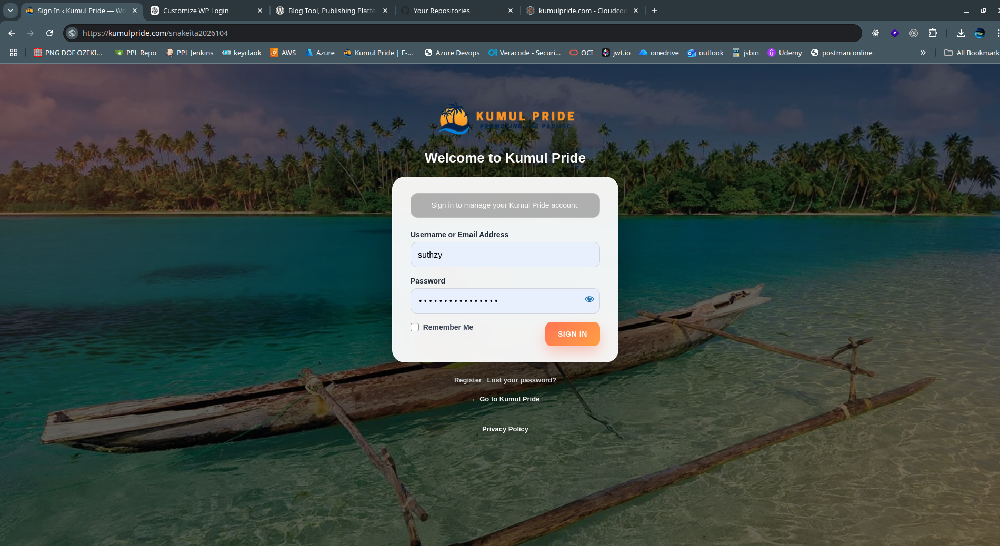

# Cloudcode Beautify Login

Cloudcode Beautify Login is a lightweight WordPress plugin that helps you hide the default WordPress login URL and beautify the WordPress login page with custom text, colors, account links, and full CSS control.

This README is for the stable working release based on the v1.0.2 logout-fix code path, updated as v1.0.3 with custom Register and Lost Password link settings.

---

## Sample Branded Login Page

The screenshot below shows Cloudcode Beautify Login running on the Kumul Pride website with a custom login slug, custom logo/background through CSS, and a branded login form.



Example shown:

- Custom login URL slug: `snakeita2026104`
- Branded login URL: `https://kumulpride.com/snakeita2026104/`
- Custom title: `Welcome to Kumul Pride`
- Custom login message: `Sign in to manage your Kumul Pride account.`
- Custom button text: `SIGN IN`
- Custom background image with dark transparent overlay
- Custom logo controlled through CSS
- Register link and Lost your password link can be redirected to custom frontend pages

---

## Features

- Set a custom login URL slug.
- Redirect direct unauthenticated access to `/wp-login.php`.
- Redirect direct unauthenticated access to `/wp-admin`.
- Allow logged-in administrators to use `/wp-admin` normally.
- Keep `wp-admin/admin-ajax.php` available for frontend functionality.
- Configure a custom Register link URL.
- Configure a custom Lost your password link URL.
- Configure login button text.
- Configure primary brand color.
- Configure login page title and message.
- Add full custom CSS through a textarea.
- Use CSS to add your own logo and background image.
- Includes emergency recovery instructions.
- Does not rename or edit WordPress core files.

---

## What Changed in v1.0.3

This release is based on the working v1.0.2 logout-fix plugin.

Changes in v1.0.3:

- Removed the old **Logo image URL** setting.
- Removed the old **Background image URL** setting.
- Added **Register link URL**.
- Added **Lost your password link URL**.
- Kept the existing **Custom login CSS** textarea.
- Kept the working custom login URL routing.
- Kept the working logout handling.

Logo and background images should now be controlled through the custom CSS textarea.

---

## Installation

### Install from WordPress Admin

1. Log in to WordPress Admin.
2. Go to **Plugins -> Add New -> Upload Plugin**.
3. Upload the plugin ZIP file.
4. Click **Install Now**.
5. Click **Activate Plugin**.
6. Go to **Settings -> Cloudcode Beautify Login**.

### Manual Installation

1. Extract the plugin ZIP file.
2. Upload the folder to:

```text
wp-content/plugins/cloudcode-beautify-login
```

3. Go to the WordPress admin dashboard.
4. Open **Plugins**.
5. Activate **Cloudcode Beautify Login**.
6. Open **Settings -> Cloudcode Beautify Login**.

---

## Recommended Kumul Pride Settings

```text
New login URL slug: snakeita2026104
Redirect blocked login attempts to: 404
Register link URL: https://kumulpride.com/account/#rg
Lost your password link URL: https://kumulpride.com/reset-password
Login button text: Sign In
Primary brand color: #ff7555
Login page title: Welcome to Kumul Pride
Login page message: Sign in to manage your Kumul Pride account.
```

The custom login URL becomes:

```text
https://kumulpride.com/snakeita2026104/
```

---

## Using Custom CSS for Logo and Background

The plugin intentionally keeps the login design flexible. Use the **Custom login CSS** textarea to add your own logo, background image, dark overlay, form styling, and responsive rules.

Do not include `<style>` tags. Paste CSS only.

Example:

```css
body.login {
    min-height: 100vh;
    background:
        linear-gradient(rgba(0, 0, 0, 0.62), rgba(0, 0, 0, 0.62)),
        url("https://example.com/wp-content/uploads/login-background.jpg") !important;
    background-size: cover !important;
    background-position: center center !important;
    background-repeat: no-repeat !important;
    background-attachment: fixed !important;
}

.login h1 a {
    background-image: url("https://example.com/wp-content/uploads/logo.png") !important;
    background-size: contain !important;
    background-position: center !important;
    background-repeat: no-repeat !important;
    width: 260px !important;
    height: 95px !important;
    margin: 0 auto 12px !important;
}

.login h1::after {
    content: "Welcome to Your Brand";
    display: block;
    color: #ffffff !important;
    font-size: 26px !important;
    font-weight: 800 !important;
    text-align: center !important;
}

.login form {
    background: rgba(255, 255, 255, 0.94) !important;
    border-radius: 24px !important;
    box-shadow: 0 28px 80px rgba(0, 0, 0, 0.38) !important;
    padding: 34px 34px 30px !important;
}
```

---

## Testing Checklist

Use a private/incognito browser window.

1. Open the custom login URL, for example:

```text
https://example.com/snakeita2026104/
```

It should show the branded WordPress login page.

2. Try the default login URL:

```text
https://example.com/wp-login.php
```

It should redirect to the configured blocked-login destination.

3. Try unauthenticated `/wp-admin`:

```text
https://example.com/wp-admin
```

It should redirect to the configured blocked-login destination.

4. Log in through the custom URL and confirm `/wp-admin` works normally.

5. Click **Logout** from the WordPress toolbar and confirm logout completes correctly.

6. Click **Register** and **Lost your password?** and confirm they go to your configured custom URLs.

---

## Emergency Recovery

If you forget the custom login URL or the plugin causes a problem, disable it from hosting File Manager, FTP, or SSH.

Rename:

```text
wp-content/plugins/cloudcode-beautify-login
```

to:

```text
wp-content/plugins/cloudcode-beautify-login-disabled
```

Then log in with the normal WordPress login URL:

```text
https://example.com/wp-login.php
```

You can also temporarily add this line to `wp-config.php`:

```php
define('CLOUDCODE_BEAUTIFY_LOGIN_DISABLE', true);
```

Remove the line after fixing the issue.

---

## Important Security Note

Changing the login URL reduces automated bot attempts against common WordPress login paths, but it is not a full security solution.

Use this plugin together with:

- Strong administrator passwords.
- Two-factor authentication.
- Regular WordPress, theme, and plugin updates.
- Regular backups.
- Malware scanning.
- A web application firewall where available.

---

## Developer Notes

Main plugin file:

```text
cloudcode-beautify-login.php
```

Key WordPress hooks and APIs used:

```php
add_action('init', ...)
add_filter('login_url', ...)
add_filter('logout_url', ...)
add_filter('lostpassword_url', ...)
add_filter('register_url', ...)
add_filter('site_url', ...)
add_filter('login_headerurl', ...)
add_filter('login_headertext', ...)
add_filter('gettext', ...)
add_rewrite_rule()
flush_rewrite_rules()
register_setting()
wp_safe_redirect()
wp_nonce_url()
wp_verify_nonce()
wp_logout()
```

---

## Changelog

### 1.0.3

- Based on the last working v1.0.2 logout-fix code path.
- Removed Logo image URL setting.
- Removed Background image URL setting.
- Added Register link URL setting.
- Added Lost your password link URL setting.
- Kept Custom login CSS textarea for advanced branding.
- Kept custom login URL behavior.
- Kept logout fix.

### 1.0.2

- Fixed logout handling through the custom login URL.

### 1.0.1

- Improved custom login action handling.

### 1.0.0

- Initial release.

---

## License

GPLv2 or later.

---

## Author

Cloudcode PNG Limited  
https://www.cloudcode.com.pg/
